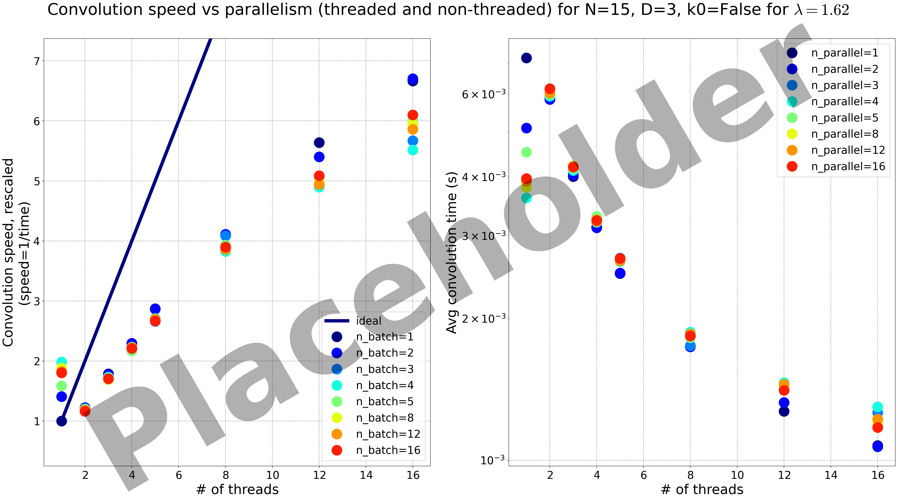

Latest benchmark
################

*This is automatically updated with the benchmark from the latest working commit on master. Benchmarks are performed on our computation server Yoshi.*

*On the public docs (pyloggrid.readthedocs.io), you don't have access to the benchmark images. You can generate them yourselves using ``Utils/benchmarking_parallel.py`` and ``Utils/benchmarking_anyparam.py``*

Parallel benchmark
******************

Vs grid size
************

.. image:: static/img/benchmark/benchmarking_anyparam.png
  :alt: Benchmark vs grid size
