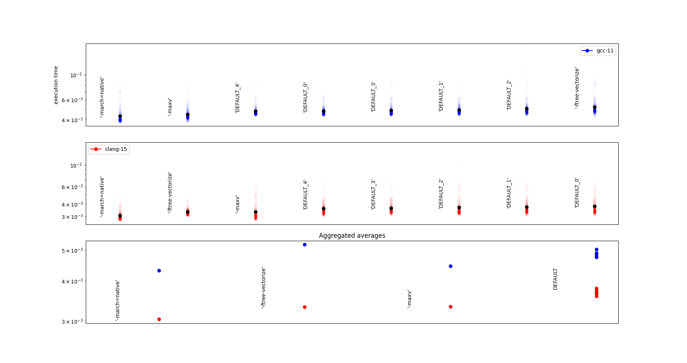

**********************
Optimizing performance
**********************

Performance = convolutions
##########################

Let's run the simulation in :doc:`../tutorial/tutorial_first_simu` with ``end_simulation = {"ode_step": 100}``.
Once the simulation finishes, it output some information such as :class:`TimeTracker <pyloggrid.Libs.misc.TimeTracker>` data:

.. code-block:: bash

    elapsed: {total: 10s 533ms, convolution: 8s 3ms, convolution_C: 7s 803ms, update_gridsize: 42ms, disk: 7ms}

We see that nearly all the time of the simulation is spent computing convolutions. Therefore, that's where the main focus on performance lies.

.. _Windows vs Linux:

Windows vs Linux
################

The convolver is compiled differently in Linux (using Clang) and Windows (using GCC via MinGW-64).

.. note:: (For Windows) Although we have made the convolver MSVC-compatible, compiling it with MSVC is a big pain compared to using GCC/Clang, especially regarding the location of the include folders. Therefore, it is for now not possible to compile it with MSVC. If that's a feature you need badly feel free to open a pull request/issue, but it's so easy to install MinGW-64 through `choco <https://chocolatey.org/install>`_ that we don't think it's a feature to prioritize.

.. important:: We recommand having ``clang`` point to Clang 15 and ``gcc`` point to GCC 12, as earlier versions do not provide the same optimizations. We have not properly tested more recent versions, but have had issues (unexpected slowdowns) with the beta of Clang 17, therefore we recommend running a :ref:`benchmark <Running benchmarks>` after upgrading and comparing with earlier results.

.. important:: The development team runs all its big simulations on Linux servers. As a result, **the Windows GCC version is significantly less optimized than the Linux Clang version**. In particular, the Windows version has no OMP support (multithreading) and unoptimized flags.

.. _Running benchmarks:

Running benchmarks
##################

.. note:: See also: :doc:`../benchmark`

To help optimize performance, three benchmarking utilities are provided.

Benchmarking compilation flags
******************************

.. note:: When you install PyLogGrid using ``pip``, the convolver is automatically compiled using our set of flags "optimized" for a specific workflow. This optimization is good enough for most configurations, but may be suboptimal for your use case. To recompile the convolver, download the `source <https://github.com/hippalectryon-0/pyloggrid/releases>`_, modify the flags in ``pyloggrid/LogGrid/Makefile[.windows]``, and re-install (see :ref:`Manual installation`).

Determining the "best" combination of compile and/or link flags for a given program is a notoriously hard task, even if the code to optimize is relatively simple.
We have developed a (very) simple tool to bruteforce a suitable combination of flags, located in ``Utils/benchmark_c``.

First, set top-level parameters in ``c_optimizer.py``: list of compilers, default flags, flags to test, parameters of individual benchmarks.

You then run ``c_optimizer.py`` to test all configurations, which by default opens the result visualization once it finishes.
If you want to only show the vizualisation, run ``analyze_results.py`` (can be done while tests are ongoing).

.. warning:: Keep in mind that many external parameters, such as the amount of used RAM, the power settings, etc. can greatly affect your benchmarks.

.. warning:: You may want to delete the ``results`` folder before doing new tests, otherwise visualisation will also include older tests.

The visualisation shows a graph (example below).
At the top we have one graph per compiler, showing execution time for each flag, with run spread appearing in transparency.
At the bottom we have an aggregation of the mean times of each compiler, grouped by flags.
Each time, the flags are ordered by increasing mean time.

In this example, we see that gcc-13 (without openmp) is significantly slower than clang-15 (with openmp), and that among the flags tested, ``march-native`` has the greatest impact.

By iteratively testing flags from a list and adding the fastest until new flags are all worse or equal to the baseline, we can construct a good list of somewhat optimized flags.

Benchmarking parallelization
****************************

Another common question is "what is the best ``n_threads`` parameter in :class:`Solver <pyloggrid.LogGrid.Framework.Solver>` ?", i.e. how to optimize the number of threads over which to parallelize.

PyLogGrid offers two ways to handle parallelization:

* the ``n_threads`` parameter in :class:`Solver <pyloggrid.LogGrid.Framework.Solver>` sets over how many threads simulations are distributed,
* the :attr:`pyloggrid.LogGrid.Grid.Maths.convolve_batch` allows several convolutions to be computed together, e.g. to take advantage of `AVX <https://en.wikipedia.org/wiki/Advanced_Vector_Extensions>`_. The number of concurrent operations is set internally.

To benchmark those two dimensions, two scripts are available in ``Utils``: ``benchmarking_parallel.py`` and ``benchmarking_anyparam.py``.

benchmarking_parallel.py
========================

This script benchmarks the convolution as a function of the number of threads and the number of parallel convolutions. You can set specific options at the top of the file.

The benchmark outputs this kind of graph:

.. image:: ../static/img/benchmark/benchmarking_parallel.png
    :alt: <Parallel benchmark image>

benchmarking_anyparam.py
========================

For more specific benchmarks, use ``benchmarking_anyparam.py``.
The default configuration benchmarks the convolution speed VS the grid size.

How to use:
-----------

The benchmark is performed for varying values of a parameter in ``x``.

For each value of ``x``, ``init_newparam`` is called to set the parameter-dependant environment in which operations will be performed (ex: new grid with size ``x[i]``). The environment dict is then forwarded to the two following functions.

For each cycle, ``init_cycle`` initialize operations (ex: the grid is filled with random fields).

Finally, ``do_cycle``, perform the elementary benchmarked operations.

The benchmark outputs this kind of graph:

.. image:: ../static/img/benchmark/benchmarking_anyparam.png
    :alt: <Grid size benchmark image>