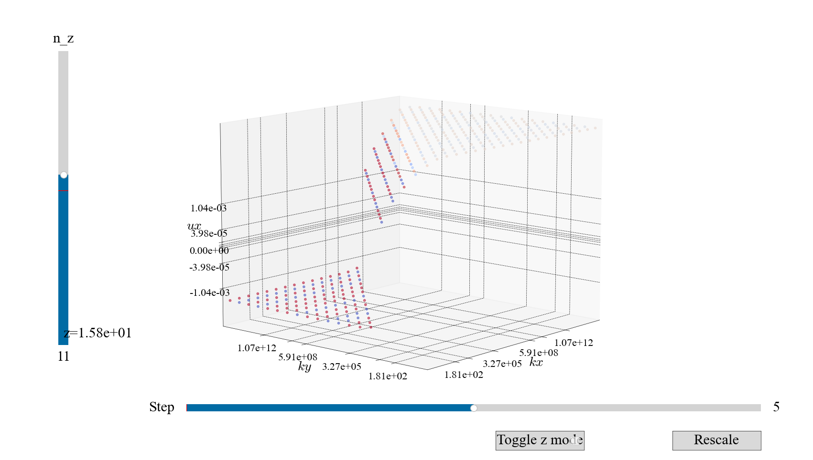

****************
Plotting library
****************

In order to facilitate plotting results using PyLogGrid, the library :mod:`~pyloggrid.Libs.plotLib` provides a number of utilities.

.. note:: An interactive notebook showcasing the functions discussed below is available in ``Utils/plotting``.

Unified formatting
##################

Importing :mod:`~pyloggrid.Libs.plotLib` automatically runs :func:`~pyloggrid.Libs.plotLib.initFormat`, which sets up a number of formatting options for all plots. Those formatting options are chosen for scientific-style, quick graphs.

.. note:: If you itend to create cleaner figures for articles, you can call ``.initFormat(rcParams={"text.usetex": True})``.

The default style, shown below, cycles through colors and line/marker styles. The color palette is colorblind-friendly and perceptually uniform.

Common functions
################

Three functions, :func:`~pyloggrid.Libs.plotLib.pltshowm` :func:`~pyloggrid.Libs.plotLib.labels` :func:`~pyloggrid.Libs.plotLib.scatter`, wrap around the :mod:`matplotlib.pyplot` equivalents :func:`~matplotlib.pyplot.show` :func:`~matplotlib.pyplot.xlabel` :func:`~matplotlib.pyplot.scatter`.

pltshowm
********

:func:`~pyloggrid.Libs.plotLib.pltshowm` calls :func:`~matplotlib.pyplot.show` with additional arguments, such as the ability to maximize the figure, to save it to disk, to hide the legend, or to change the layout.

labels
******

:func:`~pyloggrid.Libs.plotLib.labels` calls :func:`~matplotlib.pyplot.xlabel` on each axis

scatter
*******

:func:`~pyloggrid.Libs.plotLib.scatter` calls :func:`~matplotlib.pyplot.plot` to mimic the behavior of  :func:`~matplotlib.pyplot.scatter` while cycling on the same parameters as lines (instead e.g. of having a separate color cycler).

Axes
####

:func:`~pyloggrid.Libs.plotLib.plot2axes` and :func:`~pyloggrid.Libs.plotLib.plot2axesX` return either vertical or horizontal twin axes.

Sliders
#######

PyLogGrid provides a number of helpers to produce interactive graphs depending on a slider, typically to browse through different simulation steps.

:func:`~pyloggrid.Libs.plotLib.dec_enable_slider_save` is a decorator used on functions that return a slider, used to enable saving slider animations to video. It's automatically enabled for the default interactive functions.

:func:`~pyloggrid.Libs.plotLib.interactive_spectrum` plots on the left side spectra (log-log) and on the right side time-dependent scalars (lin-lin).

:func:`~pyloggrid.Libs.plotLib.interactive_3D_logplot_by_z` makes a 3D plot of 2D aggregates of a 3D field. It either plots only a given z-plane, or all z-planes together. The vertical coordinate shows the amplitude of the field. If we plot a single z-plane, the color shows the phase of the field. If all z-planes are aggregated, the color shows the highlighted z-plane.

:func:`~pyloggrid.Libs.plotLib.interactive_3D_logplot_positive` only works on the ``k_x,k_y,k_z>0`` quadrant, and can single out points whose module is greater than a threshold.

:func:`~pyloggrid.Libs.plotLib.interactive_3D_logplot_positive` shows diagonal slices of a 3D field, with a threshold.

:func:`~pyloggrid.Libs.plotLib.interactive_grid_imshow` shows a 2D interactive :func:`~matplotlib.pyplot.imshow`.

.. image:: ../static/img/plots/interactive_grid_imshow.png
    :alt: <Interactive grid 3Dslice image>

