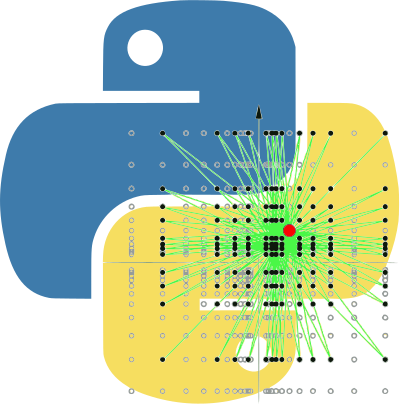
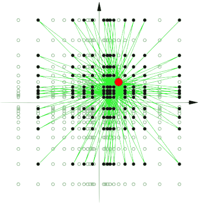

..
    [comment] TODO
    Fix errors / warnings

#####################################
Welcome to PyLogGrid's documentation!
#####################################

.. toctree::
    :maxdepth: 1
    :hidden:
    :caption: Getting started & Help

    tutorial/tutorial
    documentation/documentation
    autoapi/index

.. toctree::
    :maxdepth: 1
    :hidden:
    :caption: Other

    benchmark
    whats-new

About
#####

PyLogGrid is a Python-based framework for running and analyzing numerical simulations on :doi:`log-lattices<10.1088/1361-6544/abef73>` [1]_. The log-lattice structure is particularly useful for modeling phenomena that exhibit multi-scale behavior, such as turbulence. PyLogGrid is designed to be flexible, customizable, and easy to use.

The framework includes a variety of built-in tools for analyzing simulation results, including visualization tools and post-processing scripts.

A barebones matlab framework by another research team can be found `here <https://arxiv.org/abs/2006.00047>`_ [2]_.

--------

The philosophy
==============

Sparse Fourier simulations
--------------------------

Simulate complex systems spanning multiple scales with our numerical library. Gain insights previously unattainable with classical simulations.

Designed for physicists
-----------------------

Our library provides an intuitive and user-friendly interface for simulating and analyzing complex systems, so you can focus on your research rather than coding.

Python + C for High Performance
-------------------------------

Our library combines the ease of use and readability of Python with the speed and performance of compiled C. Get the best of both worlds for optimized execution speed.

.. [1] Campolina, Ciro S., and Alexei A. Mailybaev. "Fluid dynamics on logarithmic lattices." Nonlinearity 34, no. 7 (2021): 4684.
.. [2] Campolina, Ciro S. "LogLatt: A computational library for the calculus and flows on logarithmic lattices." arXiv preprint arXiv:2006.00047 (2020).

